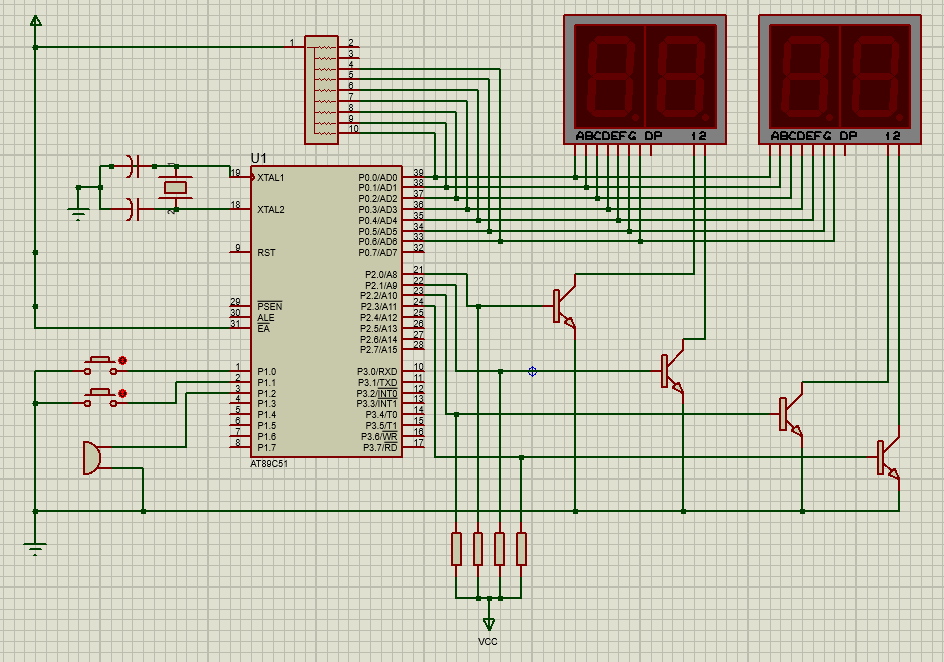

# takeanumber-8051
## Description
- Basic take-a-number system using the 8051 architecture.
- Has two dual common cathode 7-segment LEDs, one for the queue number (number taken by customer) and another for the service number (number shown on the screen, calling for a customer).
- Has three buttons: one button for incrementing queue number, one button for incrementing service number, one button for decrementing service number.
- Has a buzzer that activates temporarily for every service number increment/decrement.
- Code intended to be memory efficient, although certain parts in the code could be improved.
- Has debouncing check for buttons (instantaneous, no delay/flicker in 7-segments during debouncing check. May vary on each person's build though).
- Feel free to improve upon the code as you see fit! No need to give me credits if you want to use this code as a base or reference.
- I am **not responsible** if you get caught copying this code for your homeworks or assignments.

## To-dos
- None so far, open a pull request for any suggestions or improvements..

## Circuit Diagram (Design will not work in Proteus)

## Proteus vs. Practical Simulation Differences
Using the above design (common cathode setup) breaks the simulation in Proteus. I am not sure of the reason and the solution behind this problem. For the circuit to work in Proteus, change the setup of the 7-segments from a common cathode to a common anode setup. If you know the reason why or how to solve the problem, please edit and issue a pull request for this file (README.md) and I will go through it.
